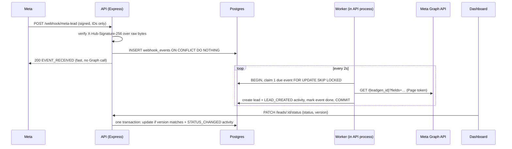

# Lead Intake Service

Receives leads from **Meta Lead Ads** webhooks, stores them with an **append-only audit trail**, and gives a sales team a dashboard to review and work them.

- **Live app:** https://leadgen-meta-ads-web.vercel.app · **API:** https://leadgen-meta-ads.onrender.com (free plan: the first request after ~15 min idle takes ~30–50 s while it wakes up)
- **Stack:**
  - API: Node 22 + TypeScript, Express 5, Prisma 7, PostgreSQL (Supabase)
  - Web: React 19 + Vite, TanStack Query, shadcn/ui, Tailwind 4
- **Meta:** real Graph API only. No mock data in the app or the tests.

---

## Contents

1. [How a lead flows through the system](#how-a-lead-flows-through-the-system)
2. [Architecture](#architecture)
3. [API](#api)
4. [Data model and audit trail](#data-model-and-audit-trail)
5. [Running locally](#running-locally)
6. [Meta setup](#meta-setup)
7. [Testing](#testing)
8. [Deployment](#deployment)
9. [Design decisions and trade-offs](#design-decisions-and-trade-offs)
10. [Scaling considerations](#scaling-considerations)
11. [Future improvements](#future-improvements)
12. [Project structure](#project-structure)

---

## How a lead flows through the system



1. **Meta sends a signed webhook containing only IDs.** A leadgen notification never carries the answers.
2. **The API verifies the signature, stores the event, and replies 200 straight away.** Meta retries for up to 36 hours and batches up to 1000 changes, so the endpoint must be fast and idempotent.
3. **A worker fetches the full lead from the Graph API**: answers, consent checkboxes, platform, campaign, ad set and ad. It then writes the lead and its `LEAD_CREATED` activity **in one transaction**.
4. **Every change a user makes (status or fields) is one transaction:** it updates the lead and appends an activity with before/after values.

---

## Architecture

```
Meta ──POST /webhook/meta-lead──┐
                                ▼
Browser ─► Vercel (React SPA) ─/api/*─► Render (Express API + in-process worker) ─► Supabase Postgres
            same origin, no CORS          Docker image, migrations on start          RLS on, no policies
```

| Choice                                                                          | Why                                                                                                                                                                        | Trade-off                                                                                       |
| ------------------------------------------------------------------------------- | -------------------------------------------------------------------------------------------------------------------------------------------------------------------------- | ----------------------------------------------------------------------------------------------- |
| **Postgres table as the queue** (the inbox pattern, `webhook_events`)           | Replies to Meta quickly, and we own the retries. Storing and enqueuing are one atomic `INSERT`. No Redis. `FOR UPDATE SKIP LOCKED` keeps several workers or instances safe | Polling adds ≤2s of latency, and throughput is bounded (see [Scaling](#scaling-considerations)) |
| **Graph fetch inside the worker's transaction**                                 | A crash at any point rolls the event back to `pending`. There's no "processing" state and no stale-lock recovery to write                                                  | Holds one DB connection for the ~300 ms HTTP call. Fine at this scale                           |
| **One Express backend, Vite SPA frontend**                                      | Validation, workflow, locking and audit all live in one place. A dashboard behind a single page gains nothing from SSR                                                     | First paint shows a skeleton                                                                    |
| **Same origin through a proxy** (Vercel rewrite in prod, Vite proxy locally)    | No CORS to configure or get wrong                                                                                                                                          | Two proxy configs to keep in sync                                                               |
| **Prisma + direct Postgres, not supabase-js**                                   | Atomic audit writes need multi-statement transactions                                                                                                                      | Row locking needs one `$queryRaw`                                                               |
| **Optimistic locking** (`version` in the request, `UPDATE … WHERE version = ?`) | A stale edit fails with 409 instead of silently overwriting                                                                                                                | The client must send the version it last saw                                                    |
| **Store the full Graph response** (`graph_response`)                            | Meta deletes leads after 90 days, so everything is kept on first fetch                                                                                                     | Some duplicated data                                                                            |
| **Offset pagination**                                                           | Simple, and gives "21–40 of 45"                                                                                                                                            | Deep pages get slower (keyset is the scaling path)                                              |
| **Server returns `allowedTransitions`**                                         | The API is the single source of truth for the workflow; the UI only renders what it's told                                                                                 | One extra field per response                                                                    |

Code layout follows **Node.js Best Practices** on the API side (business modules, with routes → service → repository) and **Bulletproof React** on the web side (`app/`, `features/`, shared `components/`, imports flowing one way). See [Project structure](#project-structure).

---

## API

Errors always use this shape: `{ "error": { "code", "message", "details?" } }`. Every response carries an `X-Request-Id`.

| Method and path                                | Purpose                                                                                                                                                  |
| ---------------------------------------------- | -------------------------------------------------------------------------------------------------------------------------------------------------------- |
| `GET /webhook/meta-lead`                       | Meta's verification handshake. Echoes `hub.challenge` as text if `hub.verify_token` matches (constant-time comparison); otherwise 403                    |
| `POST /webhook/meta-lead`                      | Receives leadgen events. See the details below the table                                                                                                 |
| `GET /leads?status=&platform=&q=&page=&limit=` | List with filters and search (name, email, phone). Returns `{ data, page, limit, total }`, with `limit` capped at 100                                    |
| `GET /leads/:id`                               | Lead detail with `allowedTransitions` and the activity timeline                                                                                          |
| `PATCH /leads/:id/status`                      | Body `{ status, version }`. Invalid transition → 422 `INVALID_TRANSITION`; stale version → 409 `VERSION_CONFLICT`; setting the current status is a no-op |
| `PATCH /leads/:id`                             | Body `{ version, fullName?, email?, phone?, notes?, assignee? }`. See the details below the table                                                        |
| `GET /health`                                  | Database ping; returns 503 if the database is unreachable                                                                                                |

**`POST /webhook/meta-lead`:**

- `X-Hub-Signature-256` must be `sha256=` followed by the HMAC-SHA256 of the **raw request bytes**; otherwise 401.
- The payload is parsed with IDs kept exactly as written.
- Each event is stored once, and the endpoint replies `200 EVENT_RECEIVED`.

**`PATCH /leads/:id`**, the one endpoint **beyond the assignment's four**:

- **Why it exists:** status changes alone would never produce a real `LEAD_UPDATED` event. This endpoint lets users correct contact details and add notes or an assignee, and each change is audited as a field-level `{ from, to }` diff.
- **Rules:** `status` in the body → 400 `STATUS_NOT_EDITABLE`, so every status change goes through the workflow endpoint. Unchanged values write nothing.

`X-Actor` (optional, URI-encoded display name) is recorded as the actor of a change.

---

## Data model and audit trail

| Table             | Purpose                               | Notes                                                                                                                                                   |
| ----------------- | ------------------------------------- | ------------------------------------------------------------------------------------------------------------------------------------------------------- |
| `webhook_events`  | Inbox: one row per Meta leadgen event | IDs only, **no PII**. `UNIQUE(leadgen_id)` is the dedup key. Tracks `status`, `attempts`, `next_attempt_at` and a sanitised `last_error`                |
| `leads`           | Current state of each lead            | Extracted name/email/phone, the full `field_data` and `custom_disclaimer_responses`, platform and ad attribution, `graph_response`, `status`, `version` |
| `lead_activities` | **Append-only** audit log             | `type` (`LEAD_CREATED`, `LEAD_UPDATED`, `STATUS_CHANGED`), `actor` (`system:meta`, `user:<name>`, `user:anonymous`), `payload`                          |

**Audit guarantees:**

- **The history can't disagree with the lead.** A lead change and its activity are written in the same transaction. Tests inject a real database failure on the activity insert and check that the lead change rolls back too.
- **The history can't be rewritten.** A database trigger rejects `UPDATE` and `DELETE` on `lead_activities`.
- **No duplicate records.**
  - Duplicate deliveries: `UNIQUE(leadgen_id)` on `webhook_events`.
  - Reprocessing an event: `UNIQUE(leadgen_id)` on `leads`.
  - Concurrent webhook deliveries of the same lead are tested.
- **Nothing is written for a no-op.** Setting the current status, or saving identical values, writes nothing and creates no activity.
- **Concurrent edits can't both win.** Of two edits based on the same version, exactly one succeeds; the other gets 409. This holds across both PATCH endpoints and is tested.

**Status workflow:** `NEW → CONTACTED → QUALIFIED → CONVERTED`. Any open status can go to `LOST`, and `LOST → NEW` reopens a lead. `CONVERTED` is final.

**Supabase:** Row Level Security is enabled on every table with **no policies**, so Supabase's public REST API (anon key) can't read the PII. The app connects as the table owner and is unaffected.

---

## Running locally

**Prerequisites:** Node ≥ 22.12, pnpm 10 (`corepack enable`), Docker.

```bash
cp apps/api/.env.example apps/api/.env   # fill in Supabase + Meta values (see "Deployment", "Meta setup")
docker compose up --build                # api + web
```

- Web: http://localhost:5173 (`/api/*` is proxied to the API)
- API: http://localhost:4000
- Database: Supabase, via `DATABASE_URL` / `DIRECT_URL` in `apps/api/.env`.

To run the apps with hot reload instead of Docker:

```bash
pnpm install
pnpm --filter @lead-intake/api db:migrate
pnpm --filter @lead-intake/api dev      # :4000
pnpm --filter @lead-intake/web dev      # :5173
```

**Seeing leads flow without running an ad:**

```bash
pnpm lead:create                                     # a real lead on your demo form (Meta test_leads API)
pnpm webhook:replay --leadgen-id <id> --times 3 --batch   # correctly signed duplicate deliveries
pnpm webhook:replay --leadgen-id <id> --bad-signature     # expect 401
```

The replay script sends Meta-shaped payloads, signed with your App Secret, through the **same endpoint and code path** as real Meta deliveries. It exists to demonstrate duplicate and batch handling, which Meta's own tools can't trigger on demand.

---

## Meta setup

Development mode can't be used here: in development mode Meta **silently drops leadgen webhooks**, and the Lead Ads Testing Tool is disabled.

1. **Create the app and webhook.**
   - Create a Meta **Business app** and add the **Webhooks** product.
   - Subscribe to **Page → `leadgen`**.
   - Callback URL: `https://<api-host>/webhook/meta-lead`. Verify token: your `META_VERIFY_TOKEN`.
2. **Get a Page access token.**
   - Get a user token with `leads_retrieval`, `pages_manage_metadata`, `pages_show_list`, `pages_read_engagement`, `pages_manage_ads` and `ads_management`.
   - Exchange it for a long-lived token, then for a **Page access token**, which doesn't expire. That's `META_PAGE_ACCESS_TOKEN`.
3. **Subscribe the Page to the app.** Then confirm with `GET /{page-id}/subscribed_apps`.
   ```bash
   curl -X POST "https://graph.facebook.com/v25.0/{page-id}/subscribed_apps?subscribed_fields=leadgen" \
     -H "Authorization: Bearer $META_PAGE_ACCESS_TOKEN"
   ```
4. **Create two lead forms on the Page.**
   - A **test form**, used only by automated tests: `META_TEST_FORM_ID`.
   - A **demo form**, for `pnpm lead:create`: `META_DEMO_FORM_ID`.

   Meta allows **one test lead per form**, so tests and demos must not share a form.

5. **Switch the app to Live.** This needs a privacy policy URL. The web app serves one at `/privacy`, including data-deletion instructions. Set `VITE_PRIVACY_CONTACT_EMAIL` at build time.
6. **If the Page uses Leads Access Manager,** grant the app CRM access; otherwise lead reads fail.
7. **Set `META_APP_SECRET`.** It's under App settings → Basic, and is used to verify `X-Hub-Signature-256`.

**Lead fields requested:**

```
id, created_time, field_data, custom_disclaimer_responses, platform, is_organic,
form_id, ad_id, ad_name, adset_id, adset_name, campaign_id, campaign_name
```

Without an explicit `fields=`, Graph returns only `id`, `created_time`, `ad_id`, `form_id` and `field_data`. The Graph version is pinned with `GRAPH_API_VERSION=v25.0`.

---

## Testing

```bash
pnpm test                                        # everything (API needs Meta credentials, see below)
pnpm --filter @lead-intake/api test:no-meta      # API tests that need no Meta credentials
pnpm --filter @lead-intake/api test:meta         # tests against the real Graph API
pnpm --filter @lead-intake/web test
pnpm lint && pnpm typecheck && pnpm format:check
```

**API tests** use Vitest with Supertest, against a real, disposable Postgres database (`lead_intake_test`, migrated automatically, run serially). Start it with `docker compose --profile test up -d test-db` (host port 5433). The tests truncate every table, so `TEST_DATABASE_URL` must never point at Supabase.

- **Signature:**
  - valid, tampered, wrong secret, missing, no `sha256=` prefix, legacy `sha1=`, truncated
  - re-serialised unicode must _not_ verify
- **Payload:**
  - Meta's documented example with numeric IDs; an ID above 2^53 is preserved
  - batches; other fields ignored
- **Idempotency:**
  - a redelivery, a batch containing duplicates, and 5 concurrent identical deliveries each produce 1 event
  - reprocessing an event never duplicates the lead or its activity
- **Status rules:** every pair of statuses (5×5), terminal `CONVERTED`, 422, no-op.
- **Concurrency:** two PATCHes with the same version → exactly one 200 and one 409, including across the two endpoints.
- **Atomicity:** a temporary DB trigger makes the activity insert fail, so the lead change must roll back, both for user edits and for ingestion.
- **Worker:**
  - Retries use real Graph errors from an invalid token (Meta returns error 190), with backoff.
  - After the maximum number of attempts, the event is marked `failed`.
  - `SKIP LOCKED` never lets two workers claim the same event.
  - Stored errors never contain the token or any PII.
- **Real Meta** (`*.meta.test.ts`): creates a real lead with `POST /{form_id}/test_leads` and runs the full pipeline, checking the lead's actual answers.
- **Missing Meta credentials make the real-Meta tests fail with a clear message**, never skip silently.

**Web tests** use Vitest with React Testing Library, rendering real components with real props (no mocked API):

- URL filter parsing
- table links and fallbacks
- pagination
- timeline order and diffs (`<del>`/`<ins>`)
- status changer shows only allowed options
- edit dialog: validation, conflict handling, and server field errors
- display-name gate
- accessible names

**CI** (`.github/workflows/ci.yml`) has three jobs:

1. static checks
2. Postgres-backed tests
3. real-Meta tests, using the repository secrets `META_PAGE_ACCESS_TOKEN` and `META_TEST_FORM_ID`

The third job **is red until those secrets are added**, by design, and runs one at a time because the test form holds a single test lead.

---

## Deployment

Everything runs on free tiers.

1. **Supabase (Postgres).** Create a project and copy its **Session pooler** connection string (port 5432). Use it for both `DATABASE_URL` and `DIRECT_URL`:
   - Render has no IPv6 egress, and Supabase's direct connection is IPv6-only.
   - The transaction pooler (6543) is unsuitable for migrations.
2. **Render (API).**
   - New → **Blueprint** → select this repo. `render.yaml` builds `apps/api/Dockerfile` with a `/health` check.
   - Enter the secrets when prompted: `DATABASE_URL`, `DIRECT_URL`, `META_VERIFY_TOKEN`, `META_APP_SECRET`, `META_PAGE_ACCESS_TOKEN`.
   - Migrations run on container start, because the free plan has no pre-deploy hook.
3. **Vercel (web).**
   - Import the repo with **Root Directory `apps/web`**.
   - Set `VITE_PRIVACY_CONTACT_EMAIL`.
   - If your Render URL differs from `https://leadgen-meta-ads.onrender.com`, update the rewrite in `apps/web/vercel.json`.
4. **Meta.** Set the webhook callback to `https://<render-host>/webhook/meta-lead`, then `pnpm lead:create` (or the Testing Tool) to see a lead arrive.

**Free-tier behaviour to expect:**

- **Render sleeps after 15 minutes idle.** The first request takes ~50 s. The dashboard retries automatically and shows "Waking up the server…". If a webhook hits a sleeping server, Meta retries it, so it still arrives.
- **Supabase pauses projects after 7 days of inactivity.**

---

## Design decisions and trade-offs

- **No authentication.** It isn't in the assignment's scope. The UI asks for a display name, sent as `X-Actor`, only for attribution. That name is self-declared, and anyone with the URL can read and change leads.
  > **Before a real ad runs,** put the dashboard and `/leads*` behind authentication (SSO or at least a session login) and derive the actor from the authenticated user.
- **Nothing sensitive in logs.**
  - Request logs record only request id, method, path (no query string, which carries the handshake token), status and duration.
  - Headers and bodies are never logged.
  - Graph errors are reduced to code, type and `fbtrace_id`. The access token is sent in the `Authorization` header, never in URLs.
  - Config errors name the invalid variable but never echo its value.
- **Lossless ID parsing.** Meta's docs show IDs as JSON numbers, and values above 2^53 would be silently rounded by `JSON.parse`. The webhook parser keeps `id`/`*_id` values as their exact source text, using the Node 22 reviver `context.source`.
- **Question labels.** Meta returns answers keyed by question key (for example `what_is_your_budget?`). The UI humanises these keys rather than fetching each form's labels.
- **Free hosting.** The costs are cold starts, and migrations running at container start (so the Prisma CLI ships in the image, ~770 MB).

---

## Scaling considerations

| Pressure                                     | What happens                                                                                                                | Next step                                                                                                                               |
| -------------------------------------------- | --------------------------------------------------------------------------------------------------------------------------- | --------------------------------------------------------------------------------------------------------------------------------------- |
| **Webhook bursts**                           | Acknowledged with one batched `INSERT`, then drained one event at a time per worker (each takes about one Graph round trip) | Run several worker instances (safe thanks to `SKIP LOCKED`), or move to a dedicated worker service or a managed queue (SQS/Cloud Tasks) |
| **Graph API rate limits**                    | Page-level limit of 200 × 24 × leads in the last 90 days; errors are retried with exponential backoff                       | Honour rate-limit headers, and add a token-bucket limiter per Page                                                                      |
| **DB connection held during the Graph call** | One connection per in-flight worker                                                                                         | Fetch outside the transaction, then claim with a short lease                                                                            |
| **Large lead tables**                        | Offset pagination slows on deep pages; `ILIKE` search is a sequential scan                                                  | Keyset pagination on `(created_at, id)`; a `pg_trgm` GIN index or Postgres full-text search                                             |
| **Many API instances**                       | Stateless HTTP; a worker per instance is safe                                                                               | Split the worker from HTTP so they scale independently                                                                                  |
| **Audit volume**                             | Append-only and indexed by `(lead_id, created_at)`                                                                          | Partition `lead_activities` by month and archive old partitions                                                                         |

---

## Future improvements

- Authentication and SSO, with the actor taken from the authenticated user.
- **Reconciliation job:** `GET /{form_id}/leads?filtering=time_created>…` to catch any webhook lost past Meta's 36-hour retry window, before Meta's 90-day deletion.
- Fetch and cache each form's real question labels.
- A "Refresh from Meta" action, which would emit `LEAD_UPDATED` with actor `system:meta`.
- Send lead stages (QUALIFIED, CONVERTED) back to Meta's **Conversions API for CRM** to improve ad optimisation.
- Mutual TLS (mTLS) on the webhook endpoint (Meta supports client certificates).
- Alerting on Graph error 190 (token revoked) and on events marked `failed`, plus an admin view to requeue them.
- Run migrations as a separate job to slim the runtime image.
- Keyset pagination and indexed search.

---

## Project structure

```
apps/
  api/                               Express API
    prisma/                          schema.prisma, migrations (incl. audit trigger + RLS)
    src/
      modules/ingestion/             Meta webhook → webhook_events → worker → lead
      modules/leads/                 lead lifecycle: routes → service → repository, workflow, diff
      lib/                           config, logger, errors, prisma, Graph client, actor
      app.ts                         composition root
      server.ts                      HTTP server, worker, graceful shutdown
    scripts/                         create-test-lead, replay-webhook
    test/support/                    test DB, real-Meta helpers, fault injection
  web/                               React SPA
    src/
      app/                           layout, router, routes (detail route lazy-loaded)
      features/leads/                API hooks, components, URL query helpers
      components/                    shared UI; components/ui = shadcn/ui
      hooks/, lib/                   actor, API client, query client, formatting
docker-compose.yml                   one-command local stack
render.yaml, apps/web/vercel.json    deployment
.github/workflows/ci.yml             CI
notes/ai-log.md                      step-by-step build log (source for AGENT.md)
```
